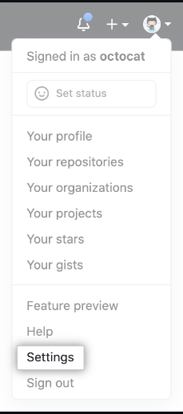
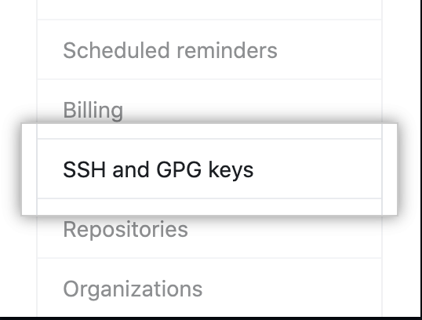
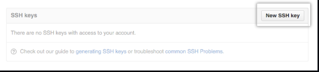
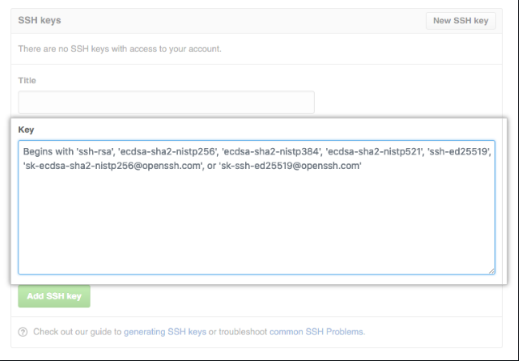

# Medical Chat app How to 

## Travailler avec git en local 

1. Installation de git 

    ●   Installer git sur Linux
    
    ``` sudo apt-get install git ```
    
    ●   Installer git sur windows
        
    <a href="https://git-scm.com/download/win"> Telecharge git pou windows </a>

2. Paramétre de base
    
    Apres avoir installer git vous devez faire une première
    configuration afin git puisse vous identifier

    ● Configuration du nom d’utilisateur

    ```git config --global user.name username```

    d'ou ___username___ doit etre remplace par ton nom d'utlisateur de votre compte GitHub. 
    
    Exemple: __git config --global user.name tchassijordan__

    ● Configuration de l’adresse mail

    ```git config --global user.email my@email.com```

    d'ou ___my@email.com___ doit etre remplace par le email que vous aviez utilise pour cree votre compte GitHub. 
    
    Exemple: __git config --global user.email tchassijordan@gmail.com__

    ● Verification de ses paramétres

    ```git config --list```

## Cloné le repository

1. Ouvrir votre IDE de preference (exemple vs code) et ouvrez un terminal dans cette IDE. 
Ou bien ouvrez simplement un terminal (pour les utilisateur linux), ou le git bash (pour les utilisateur window qu'on git installe). 

2. Placez vous dans le repertoire où vous desirez sauvegarder le repository du project (ensemble des fiches du projet en provenance de GitHub). 
    1. Sur linux suffit de faire ___``` cd /home/<nom_utilisateur>/<destination de sauvegarde>```___ <br> Exemple: _``` cd /home/jordan/Desktop```_ 

    2. Sur windows, ___``` cd /<nom_disque>/<nom_utilisateur>/<destination de sauvegarde>```___ <br> Exemple: ``` cd /C/jordan/Desktop```

3. Ecrivez cette command pour cloné le repository (linux comme Gitbash) <br> __``` git clone git@github.com:tchassijordan/medical-chat-app.git```__ 

4. Dernierement (sur le terminal ou Gitbash) placez vous dans le repository cloné dans ta machine. 

    1. Sur linux suffit de faire ___``` cd /home/<nom_utilisateur>/<destination de sauvegarde>/medical-chat-app```___ <br> Exemple: _``` cd /home/jordan/Desktop/medical-chat-app```_ 
    2. Sur windows, ___``` cd /<nom_disque>/<nom_utilisateur>/<destination de sauvegarde>/medical-chat-app```___ <br> Exemple: ``` cd /C/jordan/Desktop/medical-chat-app```

## Modifie le fiche 

### Cree un remote repository

__Note:__ Avant de continue assurez vous que vous aviez faire <u>_l'etape 4 de cloné le repository_ precedente.</u>
Et aussi tout les commandes en-dessous doit etre fait dans le même espace de travail que _l'etape 4 de cloné le repository_ precedente

1. __Qu'est ce qu'un remote?__
<br>Un remote est just le lien vers l'endroit où le repository est stocke sur l'internet. Pour modifie un repository qu'est stocke sur l'internet il faut dit a git où ce fiche est stocke pour qu'il puis le modifie.  

2. __Comment specifie le remote de ce projet?__
<br> Entrez les ligne de commande suivant sur le terminal or Gitbash.<br>_``` git remote add origin  git@github.com:tchassijordan/medical-chat-app.git  ```_

### Configurer l'authentification entre git en local et ton compte Github. 

Pour pouvoir modifie ce repository il faut cree une connexion entre git et GitHub. Dans d'autre terme il faut donne l'access a git en local de pouvoir interagit avec ton compte GitHub qu'est sur l'internet. Il y a plusieur façon de faire, mais je vais explique la methode de _l'authentification par ssh_. Suivez les intructions suivant pour le faire. 

1. #### Générer une nouvelle clé ssh
    Entre la ligne de commande suivant
    
    __``` ssh-keygen  -t  ed5519  -C  “your_email@example.com” ```__

2. #### Ajouter votre clé ssh à votre agent-ssh
    1. Lancer l'agent-ssh
        
        Entre la ligne de commande suivant
        
        __``` eval “$(ssh-agent -s)” ```__

        Lorsque vous êtes invité à « Entrez un fichier dans lequel enregistrer la clé », [Appuyez sur Entrée].

         Lorsque vous êtes invité à « Entrez un mot de passe sécurisé ». [Appuyez sur Entrée]

    2. Ajoutez votre clé privée à votre ssh-agent
        <br> Entre la ligne de commande suivant
        <br> __``` ssh-add  ~/.ssh/id_ed25519 ```__

3. #### Ajouter une nouvelle clé ssh à votre compte GitHub
    1. Copiez la clé publique SSH dans votre clipboard.
        1. __Pour Windows__: pbcopy < ~/.ssh/id_ed25519.pub

        2. __Pour Linux__: cat  ~/.ssh/id_ed25519.pub
        <br> Puis sélectionnez et copiez le contenu du fichier id_ed25519.pub affiché dans le terminal à votre presse-papiers 
    2. Dans le coin supérieur droit de n'importe quelle page, cliquez sur votre photo de profil, puis sur Paramètres.

        
    
    3. Dans la barre latérale des paramètres utilisateur, cliquez sur les clés SSH et GPG.

        

    4. Cliquez sur Nouvelle clé SSH ou Ajouter une clé SSH.

        

    5. Dans le champ "Titre", ajoutez une étiquette descriptive pour la nouvelle clé. Par exemple, si vous utilisez un Lenovo personnel, vous pouvez appeler cette touche "Personal lenovo".

    6. Collez votre clé dans le champ "Clé".

        

    7. Cliquez sur Ajouter une clé SSH.
        
        

    8. Si vous y êtes invité, confirmez votre mot de passe GitHub.

### Recevoir le nouveau repository qui a ete mise a jour.
Entrez les ligne de commande suivant sur le terminal 

```git pull origin nom_de_la_branch ```

Exemple: ```git pull origin main ```

### Envoye les mise a jour fait 
Entrez les ligne de commande suivant sur le terminal 

```git push origin nom_de_la_branch ```

Exemple: ```git push origin main ```
